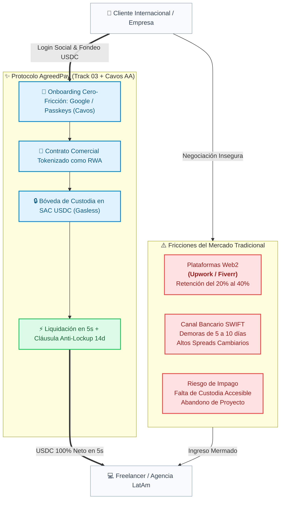

# AgreedPay: Arquitectura Técnica y Dossier Operativo de Ejecución (v2 con Cavos)
##### *Tokenización de Contratos Comerciales (RWA), Custodia Programable de Escrow, Abstracción de Cuentas (Cavos) y Liquidación Condicional con Soroban Smart Contracts en Testnet*

--------------------------------------------------------------------------------

#### 📌 Ficha Ejecutiva del Proyecto
| Parámetro | Detalle Oficial |
| ------ | ------ |
| **Nombre del Proyecto** | **AgreedPay** |
| **Track Oficial** | **Track 03: Real-World Assets & Compliant Rails** |
| **Integrantes del Equipo** | 4 Desarrolladores (Coautoría obligatoria en GitHub) |
| **Entorno de Red** | Stellar Testnet & Soroban RPC Runtime |
| **Moneda de Liquidación** | Stellar Asset Contract (SAC) USDC (Precisión fija: 7 decimales) |
| **Capa de Autenticación & Abstracción** | **Cavos Kit (`@cavos/kit`)** — Login Social (Google/Passkeys) + Gasless Transactions + Support Dual con Freighter |
| **Licencia de Software** | Código Abierto Permisivo (MIT License) |

--------------------------------------------------------------------------------

#### 1. Resumen Ejecutivo (Abstract)
**AgreedPay** es una aplicación descentralizada (dApp) diseñada para tokenizar y automatizar la custodia condicional (*escrow*) de contratos comerciales de prestación de servicios tecnológicos y cuentas por cobrar (*accounts receivable*) sobre la red Stellar.

El sistema erradica las comisiones intermedias abusivas (20% - 40%) de plataformas Web2 y las demoras bancarias transfronterizas. Mediante contratos inteligentes en **Soroban (Rust)** compilados bajo la directiva `#![no_std]`, las empresas fondean presupuestos en USDC nativo en hitos inmutables. 

Para eliminar la fricción de incorporación Web3 en empresas tradicionales (RWA), **AgreedPay integra Cavos (`@cavos/kit`)**, permitiendo inicios de sesión sociales en 5 segundos (Google, Apple, Passkeys) y **transacciones sin gas (Gasless/Sponsored Escrow)**, manteniendo soporte nativo para billeteras como Freighter.

--------------------------------------------------------------------------------

> **Estado de implementación:** la dApp usa Cavos/Freighter y los hooks Soroban disponibles. El contrato desplegado no expone `dispute_milestone`, no publica eventos y no es una factory de acuerdos; la apertura on-chain de disputas y la creación de un contrato por formulario requieren una nueva versión del contrato. La fuente de verdad es `contracts/escrow_milestones/src/lib.rs`.

#### 2. Planteamiento del Problema y Tesis de RWA


--------------------------------------------------------------------------------

#### 3. Arquitectura del Sistema y Flujo de Interacción
##### 3.1. Arquitectura Topológica de Capas
```mermaid
flowchart TB
    classDef clientLayer fill:#f0fdf4,stroke:#16a34a,stroke-width:2px,color:#14532d;
    classDef web3Layer fill:#eff6ff,stroke:#2563eb,stroke-width:2px,color:#1e3a8a;
    classDef coreLayer fill:#fefce8,stroke:#ca8a04,stroke-width:2px,color:#713f12;
    classDef storageLayer fill:#fdf2f8,stroke:#db2777,stroke-width:2px,color:#831843;

    subgraph UserLayer["👥 Capa de Usuarios & Autenticación (Dual)"]
        ClientUser["Empresa Contratante<br>(Google / Passkeys via Cavos OR Freighter)"]:::clientLayer
        DevUser["Desarrollador / Agencia LatAm<br>(Passkeys via Cavos OR Freighter)"]:::clientLayer
    end

    subgraph FrontendApp["🖥️ Capa de Aplicación Frontend (React + Vite + Tailwind)"]
        CavosKit["@cavos/kit & @creit-tech/stellar-wallets-kit<br>Gestión de Billeteras Embebidas & Relayer Gasless"]:::web3Layer
        ClientDash["Panel del Cliente<br>• Crear Acuerdo RWA<br>• Fondeo USDC (Sponsored Gas)<br>• Firma de Aprobación"]:::web3Layer
        DevDash["Panel del Freelancer<br>• Carga de Hashes SHA-256<br>• Solicitud de Liberación<br>• Reclamo por Timeout"]:::web3Layer
    end

    subgraph NetworkLayer["🌐 Capa de Comunicación & Consenso (Stellar Testnet)"]
        CavosRelayer["Cavos Relayer / Paymaster<br>Patrocinio de Reserva XLM y Comisiones de Red"]:::coreLayer
        RPCNode["Soroban RPC Service<br>simulateTransaction() ➔ assembleTransaction()"]:::coreLayer
        StellarRPC["Stellar RPC / Portfolio API<br>getLedgerEntries() ➔ Account & SAC Balance Check"]:::coreLayer
    end

    subgraph SorobanRuntime["⚙️ Capa On-Chain (Smart Contracts en Rust #![no_std])"]
        EscrowContract["Contrato Principal: escrow_milestones.rs<br>• __constructor inmutable<br>• require_auth() en cada rol (G... address)<br>• Cláusula Anti-Lockup (14 días)<br>• PersistentStorage con extend_ttl"]:::coreLayer
        SAC_USDC["Stellar Asset Contract: SAC USDC<br>• Precisión fija: 7 decimales<br>• Transferencia atómica de fondos"]:::coreLayer
    end

    subgraph OffchainPersist["🗄️ Capa de Auditoría & Almacenamiento Off-Chain"]
        SupabaseDB["Supabase Postgres<br>Metadatos de proyecto, repositorios y previsualizaciones"]:::storageLayer
        StellarExpert["Stellar Expert Explorer<br>Trazabilidad pública e inmutable de Hashes y Transacciones"]:::storageLayer
    end

    subgraph AILayer["🤖 Capa de Agente de IA (AI Dispute Resolver)"]
        AIAgent["🤖 Agente de IA (AI Arbitrator / Dispute Resolver)<br>• Monitorea eventos MilestoneStatus::Disputed<br>• Audita entregables vía GitHub API + LLM<br>• Emite veredicto firmado on-chain"]:::storageLayer
    end

    ClientUser --> ClientDash
    DevUser --> DevDash
    ClientDash & DevDash --> CavosKit
    CavosKit --> CavosRelayer & RPCNode & StellarRPC

    StellarRPC -->|Validación de Cuentas y Balance SAC| SorobanRuntime
    RPCNode -->|Invocación WASM| EscrowContract
    EscrowContract <-->|Transferencias Atómicas| SAC_USDC

    ClientDash & DevDash -.->|Subida de Archivos & Metadatos| SupabaseDB
    RPCNode -.->|Hashes de Tx Confirmadas| StellarExpert

    EscrowContract -.->|Evento Disputed detectado| AIAgent
    AIAgent -->|resolve_dispute() firmado con clave del bot| EscrowContract
```

--------------------------------------------------------------------------------

#### 4. Especificación Técnica de Smart Contracts en Soroban (Rust)
El contrato inteligente desplegado en Testnet (`CD6QQHMFJKOJYXNFIHSRWQTATG5AW22L6FHPFM76Y4Q2EUBFAOO563QR`) **permanece 100% inmutable y compatible** con Cavos. Cavos genera direcciones estables `G...` de Stellar que firman las entradas de `require_auth()` nativas de Soroban de forma transparente.

--------------------------------------------------------------------------------

#### 5. Plan Operativo y Asignación de Roles (4 Integrantes)

| Integrante | Rol Oficial | Entregables Clave en el Repositorio de GitHub |
| ------ | ------ | ------ |
| **Integrante 1** | **Smart Contracts Lead (Rust / Soroban)** | • Configuración de `Cargo.toml` (`#![no_std]`).<br>• Implementación de `types.rs`, `lib.rs` y `test.rs`.<br>• Despliegue en Testnet (`CD6QQHMFJKOJYXNFIHSRWQTATG5AW22L6FHPFM76Y4Q2EUBFAOO563QR`).<br>• *Sin modificaciones requeridas para Cavos*. |
| **Integrante 2** | **Web3 Core & Integration Lead (TypeScript / SDK)** | • Integración dual: `@cavos/kit` (Google/Passkeys/Gasless) + `@creit-tech/stellar-wallets-kit` (Freighter).<br>• Invocación de Soroban via `wallet.invokeContract` / `wallet.signXdr`.<br>• Configuración de `CavosProvider` y relayer gasless para Testnet. |
| **Integrante 3** | **Frontend & UI/UX Lead (React / Tailwind)** | • Integración del modal de autenticación Cavos (`<CavosAuthModal>`) en Navbar.<br>• Selector de login: "Iniciar con Google / Passkeys" vs "Conectar Freighter".<br>• Experiencia de usuario Gasless (indicadores de transacción patrocinada).<br>• Despliegue en Vercel. |
| **Integrante 4** | **Backend, QA & Video Lead (Supabase / Markdown / Pitch)** | • Actualización de diagramas en `docs/architecture.md` con la topología Cavos.<br>• Esquema Supabase para metadatos off-chain.<br>• **Video Demo y Pitch de 3 min**: Destacar el onboarding de 5 segundos con Google/Passkey y transacciones sin gas como diferenciador principal de RWA. |

--------------------------------------------------------------------------------

#### 6. Estrategia de Evaluación Oficial y Ventaja Competitiva

1. **Funcionalidad demostrable (30%):** Prototipo accesible en Vercel con ejecuciones gasless on-chain en Stellar Testnet.
2. **Integración técnica con Stellar (25%):** Combinación avanzada de **Soroban (Rust)** + **Account Abstraction (Cavos)** con firmas Ed25519 nativas, passkeys de hardware y patrocinio de reservas XLM.
3. **Originalidad y pertinencia al Track RWA (20%):** Onboarding sin fricción para empresas Web2 y freelancers en LatAm, eliminando la necesidad de gestionar frases semilla o comprar XLM previo para tarifas.
4. **Viabilidad y continuidad (15%):** Experiencia de usuario idéntica a una app fintech tradicional.
5. **Claridad del README y Video Demo (10%):** Video enfocado en la simplicidad del flujo empresarial sin gas.
