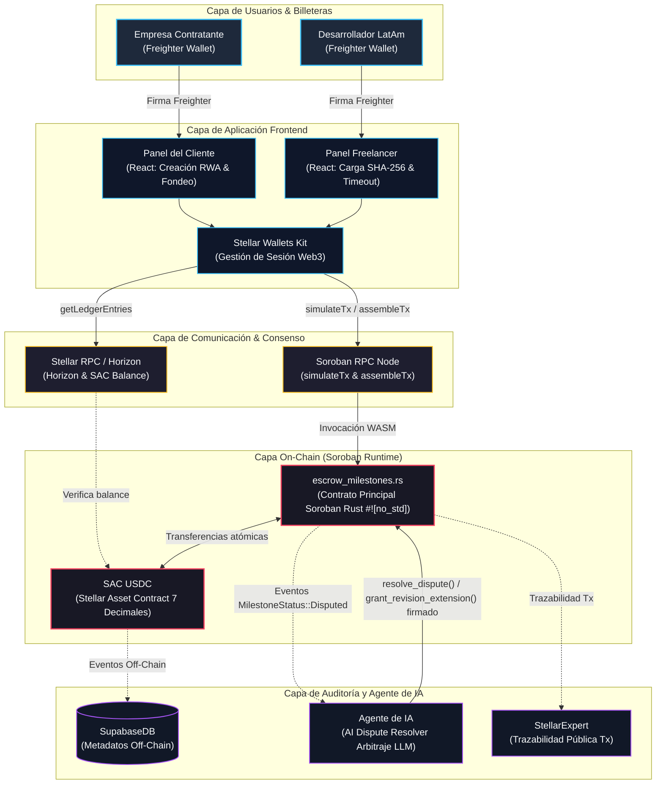
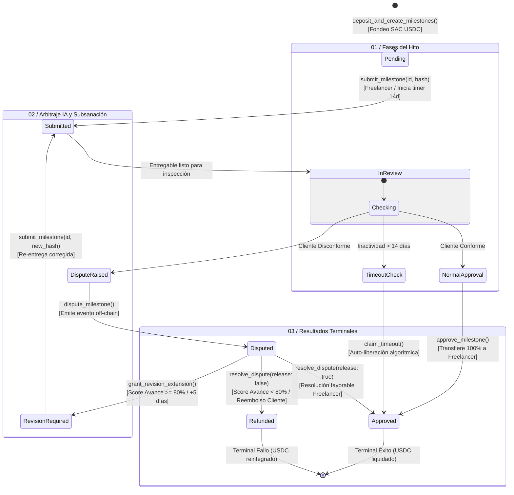

# AgreedPay: Especificación de Arquitectura de Software y Protocolo On-Chain
**Checkpoint Técnico Intermedio: Documento Maestro de Arquitectura**  
**Versión:** 1.0.0-rc  
**Ecosistema:** Stellar Network & Soroban Smart Contracts (`#![no_std]`)  
**Activo de Custodia:** SAC USDC (Stellar Asset Contract - 7 Decimales)  
**Tesis:** Tokenización RWA (Real World Assets) de Contratos Comerciales de Servicios y Arbitraje de IA  

---

## 1. Visión General del Protocolo y Tesis RWA

### 1.1. Contexto de Negocio y Problemática en LatAm
El mercado de exportación de servicios profesionales y talento tecnológico desde América Latina hacia mercados globales (principalmente Estados Unidos y Europa) enfrenta barreras operativas críticas:
* **Costos de Fricción Financiera:** Las transferencias interbancarias internacionales vía SWIFT imponen tarifas fijas y comisiones de intermediación que consumen entre el 5% y el 10% del monto contractual.
* **Tiempos de Liquidación Prolongados:** Demoras de 3 a 7 días hábiles para la compensación de fondos, agravadas por retenciones cambiarias y volatilidad de monedas locales.
* **Riesgo de Contraparte y Falta de Cumplimiento:** Los desarrolladores y agencias entregan software sin garantía fehaciente de pago, mientras que los clientes corporativos temen desembolsar anticipos sin entregables verificados.

### 1.2. La Tesis RWA de AgreedPay
**AgreedPay** aborda esta problemática transformando los contratos comerciales de servicios de software (*Statements of Work* - SOW y *Service Level Agreements* - SLA) en **Activos del Mundo Real (RWA) Tokenizados** sobre la red Stellar. 

A través de un contrato de escrow programable en Soroban, cada acuerdo de servicio comercial se materializa como un compromiso financiero inmutable donde:
1. El acuerdo legal u hoja de términos off-chain se asocia criptográficamente mediante un **hash SHA-256** del documento o especificación funcional.
2. Los fondos quedan bloqueados de forma no custodial y segregada por cada hito (*milestone*).
3. La liquidación de cada hito es atómica, algorítmica y auditable de punta a punta.

### 1.3. Custodia Segura en SAC USDC (7 Decimales)
La custodia financiera se ejecuta mediante el **Stellar Asset Contract (SAC)** del activo oficial **USDC** emitido en Stellar.
* **Precisión Numérica:** USDC en Stellar opera formalmente con **7 posiciones decimales**. La unidad mínima contable en el ledger (stroop) equivale a:
  $$\text{1 USDC} = 10{,}000{,}000\text{ stroops} = 10^7\text{ stroops}$$
* **Representación Numérica:** Toda la aritmética on-chain se procesa en tipos enteros con signo de 128 bits (`i128`), garantizando cero pérdida por redondeo y previniendo desbordamientos aritméticos (*overflow/underflow*).
* **Custodia Descentralizada:** El contrato `escrow_milestones.rs` retiene la titularidad transitoria de los tokens en su propio `Address` contractual; ningún intermediario ni administrador posee facultades para desviar fondos fuera de las transiciones de estado explícitamente autorizadas.

### 1.4. El "Plan B" de Arbitraje por Inteligencia Artificial
En contratos de desarrollo de software tradicionales, las disputas suelen quedar estancadas por semanas en tribunales o plataformas centralizadas con arbitrajes humanos costosos y subjetivos. 

AgreedPay implementa un **protocolo de resolución algorítmica basado en un Agente de IA**:
* **Disparador del Conflicto:** Si el cliente rechaza un entregable o abre formalmente una disputa, el hito entra en estado `Disputed`.
* **Auditoría Técnica Objetiva:** El agente de arbitraje off-chain inspecciona el repositorio (vía GitHub API) y analiza los commits, pull requests, cobertura de pruebas y diffs contra los criterios de aceptación del SOW.
* **Regla de Corte Funcional del 80%:**
  * **Avance ≥ 80% (Subsanación / Buena Fe):** El agente determina que existe un avance material sustantivo. Invoca on-chain `grant_revision_extension(milestone_id, 5_dias)`. El hito se traslada al estado `RevisionRequired`, otorgando al freelancer un período de gracia de **5 días calendario** para corregir observaciones sin penalización económica inmediata.
  * **Avance < 80% (Incumplimiento Crítico):** El agente determina incumplimiento severo. Invoca on-chain `resolve_dispute(milestone_id, release: false)`. El contrato inteligente reembolsa de manera inmediata e irrevocable el **100% de los USDC bloqueados** para ese hito a la cuenta de la Empresa Contratante.

---

## 2. Topología del Sistema y Arquitectura por Capas

El sistema AgreedPay se estructura en **cinco capas lógicas desacopladas**, garantizando alta cohesión, modularidad y separación estricta de responsabilidades entre el cliente Web3, la infraestructura RPC, la capa on-chain y el subsistema de oráculo de auditoría.

### 2.1. Diagrama de Arquitectura de Capas (Mermaid)



### 2.2. Detalle de Responsabilidades por Capa

1. **Capa de Usuarios & Billeteras:**
   - Autenticación criptográfica mediante la extensión no custodial **Freighter Wallet**.
   - Firma de transacciones XDR sin exponer llaves privadas fuera del entorno seguro de la billetera.
2. **Capa de Aplicación Frontend:**
   - Single Page Application (SPA) construida en React / TypeScript.
   - Integración de `@stellar/stellar-wallets-kit` para estandarizar la conexión multi-wallet y la inyección de proveedores.
   - Panel del Cliente: interfaz para parametrización de hitos, montos en USDC, cálculo de hashes SHA-256 de SOW y fondeo de contrato.
   - Panel Freelancer: vista de hitos asignados, cargador de entregables técnicos (cálculo cliente de hash SHA-256) y ejecución de gatillos de timeout.
3. **Capa de Comunicación & Consenso:**
   - **Stellar RPC / Horizon:** Sincronización del estado de cuenta Stellar, saldos de trustlines USDC y lectura directa de ledger entries con `getLedgerEntries()`.
   - **Soroban RPC Node:** Punto de entrada para la simulación previa (`simulateTransaction`) que calcula huella de almacenamiento (*footprint*), CPU/Memory gas y construye la transacción completa (`assembleTransaction`) lista para ser firmada.
4. **Capa On-Chain (Soroban Runtime):**
   - Entorno WebAssembly (WASM) de Soroban sobre Stellar Core.
   - `SAC USDC`: Token nativo que implementa la interfaz estándar de token de Soroban (`token::Client`).
   - `escrow_milestones.rs`: Lógica de negocio descentralizada, máquina de estados, control de accesos (`require_auth`) y custodia atómica.
5. **Capa de Auditoría, Oráculo IA y Trazabilidad:**
   - **SupabaseDB (PostgreSQL):** Persistencia de metadatos off-chain pesados (nombres, descripciones de hitos, URLs de GitHub, documentos SOW completos).
   - **Agente de IA (Arbitrador LLM):** Daemon off-chain que monitorea eventos de disputa on-chain, audita código y posee una llave Stellar autorizada exclusivamente para dirimir conflictos (`arbiter`).
   - **StellarExpert:** Indexador y explorador público que brinda auditoría inmutable de cada hash de transacción y llamada al contrato.

---

## 3. Ciclo de Vida del Hito y Protocolo de Interacción

El ciclo de vida de un contrato de servicio en AgreedPay transcurre a través de fases ordenadas y predecibles, contemplando tanto el camino feliz de aprobación como las rutas de contingencia (timeout y arbitraje).

### 3.1. Diagrama de Secuencia de Interacción (Mermaid)

```mermaid
sequenceDiagram
    autonumber
    actor Cliente as Cliente (Empresa)
    actor Freelancer as Freelancer (Dev LatAm)
    participant Front as Frontend (React + Kit)
    participant RPC as Stellar / Soroban RPC
    participant Escrow as Contrato Escrow (Soroban)
    participant SAC as SAC USDC (7 Dec)
    participant IA as Agente de IA (Arbitrador)

    %% ==========================================
    %% FASE 1: CREACIÓN Y FONDEO
    %% ==========================================
    rect rgb(15, 23, 42)
        Note over Cliente, SAC: Fase 1: Creación y Fondeo del Contrato RWA
        Cliente->>Front: Conecta Freighter y define hitos ($1,000 USDC)
        Front->>RPC: getLedgerEntries() / balance SAC USDC
        RPC-->>Front: Cuenta y balance verificados
        Front->>RPC: simulateTransaction() & assembleTransaction()
        RPC-->>Front: XDR armado con footprint de almacenamiento
        Cliente->>Escrow: deposit_and_create_milestones(amounts, hashes) [require_auth]
        Escrow->>SAC: transfer(from: Cliente, to: Escrow, $1,000 USDC)
        SAC-->>Escrow: Transferencia exitosa confirmada
        Escrow->>Escrow: Registra hitos en PersistentStorage y extiende TTL
        Escrow-->>Front: Transacción confirmada on-chain
    end

    %% ==========================================
    %% FASE 2: EJECUCIÓN Y CARGA
    %% ==========================================
    rect rgb(30, 41, 59)
        Note over Freelancer, Escrow: Fase 2: Ejecución y Carga de Entregable
        Freelancer->>Front: Sube entregable y calcula hash SHA-256
        Freelancer->>Escrow: submit_milestone(id: 1, proof_hash) [require_auth]
        Escrow->>Escrow: Status -> Submitted (Inicia temporizador de 14 días)
        Escrow-->>Front: Evento MilestoneSubmitted emitido
    end

    %% ==========================================
    %% FASE 3A: LIQUIDACIÓN NORMAL
    %% ==========================================
    rect rgb(6, 78, 59)
        Note over Cliente, SAC: Fase 3A: Liquidación Normal (Aprobación Cliente)
        Cliente->>Front: Revisa entregable y aprueba hito
        Cliente->>Escrow: approve_milestone(id: 1) [require_auth]
        Escrow->>SAC: transfer(from: Escrow, to: Freelancer, $250 USDC)
        SAC-->>Freelancer: Fondos liquidados instantáneamente (~5 segundos)
        Escrow->>Escrow: Status -> Approved
    end

    %% ==========================================
    %% FASE 3B: CLÁUSULA ANTI-LOCKUP
    %% ==========================================
    rect rgb(120, 53, 15)
        Note over Freelancer, SAC: Fase 3B: Cláusula Anti-Lockup (Inactividad > 14 días)
        Freelancer->>Escrow: claim_timeout(id: 1) [Valida: now >= submitted_at + 14d]
        Escrow->>SAC: transfer(from: Escrow, to: Freelancer, $250 USDC)
        SAC-->>Freelancer: Auto-liberación algorítmica completada
        Escrow->>Escrow: Status -> Approved (por Timeout)
    end

    %% ==========================================
    %% FASE 3C: ARBITRAJE IA
    %% ==========================================
    rect rgb(76, 29, 149)
        Note over Escrow, IA: Fase 3C: Arbitraje por Agente de IA (Umbral de Avance)
        Cliente->>Escrow: dispute_milestone(id: 1) [require_auth]
        Escrow->>RPC: Emite evento MilestoneStatus::Disputed
        RPC-->>IA: Polling / Webhook detecta disputa
        IA->>IA: Audita repo GitHub (Diffs, PRs, Tests vs SOW con LLM)
        
        alt Avance Funcional >= 80% (Período de Subsanación)
            IA->>Escrow: grant_revision_extension(id: 1, 5 días) [require_auth]
            Escrow->>Escrow: Status -> RevisionRequired (Prórroga de 5 días otorgada)
            Escrow-->>Front: Notificación de subsanación a Cliente y Freelancer
        else Avance Funcional < 80% (Incumplimiento Crítico)
            IA->>Escrow: resolve_dispute(id: 1, release: false) [require_auth]
            Escrow->>SAC: transfer(from: Escrow, to: Cliente, $250 USDC)
            SAC-->>Cliente: 100% USDC del hito reembolsado al Cliente
            Escrow->>Escrow: Status -> Refunded
        end
    end
```



### 3.2. Descripción Técnica Pormenorizada de Fases

#### Fase 1: Creación y Fondeo del Contrato RWA
1. **Configuración de Parámetros:** El cliente establece el listado de hitos en el frontend: monto en USDC por hito (ej. 4 hitos de $250 USDC = $1,000 USDC) y el hash SHA-256 de las especificaciones de cada hito.
2. **Pre-vuelo RPC:** El frontend invoca `simulateTransaction` en Soroban RPC para determinar las claves de lectura/escritura del ledger (*storage footprint*) y asegurar que el cliente posee saldo suficiente y la autorización del trustline en el SAC USDC.
3. **Depósito Atómico:** El cliente firma la transacción con Freighter. Se invoca `deposit_and_create_milestones`. El contrato ejecuta una transferencia atómica desde la cuenta del cliente hacia el `Address` del contrato de escrow usando el cliente SAC (`token::Client`).
4. **Persistencia y TTL:** La configuración del contrato y los hitos individuales se almacenan en `PersistentStorage` de Soroban, ejecutando inmediatamente `extend_ttl` para proteger las entradas contra archivado.

#### Fase 2: Ejecución y Carga de Entregable
1. **Hash de Prueba Off-Chain:** Al culminar el trabajo del hito, el freelancer o su pipeline de CI/CD genera un hash SHA-256 representativo del entregable (por ejemplo, el commit hash de Git o el digest criptográfico del archivo compilado/zip).
2. **Registro On-Chain:** El freelancer firma e invoca `submit_milestone(id: 1, proof_hash)`.
3. **Arranque de Temporizador:** El contrato valida que el hito se encuentre en estado `Pending` o `RevisionRequired`, almacena el `proof_hash`, registra el timestamp actual del ledger (`env.ledger().timestamp()`) y cambia el estado a `Submitted`. A partir de este segundo se computa la ventana de inactividad de **14 días** (1,209,600 segundos).

#### Fase 3A: Liquidación Normal (Aprobación Cliente)
1. **Validación:** El cliente verifica la conformidad técnica del entregable.
2. **Aprobación:** El cliente invoca `approve_milestone(id: 1)`. La función ejecuta `client.require_auth()`.
3. **Desembolso:** El contrato ordena a SAC USDC la transferencia del monto específico del hito ($2,500,000,000 stroops para $250 USDC) desde el contrato hacia el `Address` del freelancer.
4. **Finalización:** El hito pasa de forma irreversible a `Approved`.

#### Fase 3B: Cláusula Anti-Lockup (Inactividad > 14 días)
1. **Problema Mitigado:** Si el cliente desaparece, pierde acceso a su billetera o se niega a responder tras recibir el entregable, los fondos del freelancer quedarían bloqueados indefinidamente.
2. **Ejecución Algorítmica:** Pasados los 14 días desde `submitted_at`, el freelancer invoca `claim_timeout(id: 1)`.
3. **Verificación Estricta:** El contrato evalúa algorítmicamente:
   ```rust
   env.ledger().timestamp() >= milestone.submitted_at + 1_209_600
   ```
4. **Auto-Liberación:** Si la condición temporal se cumple, el contrato transfiere los fondos correspondientes al freelancer sin requerir la firma del cliente, previniendo el secuestro de liquidez.

#### Fase 3C: Arbitraje por Agente de IA (Umbral de Avance)
1. **Apertura de Disputa:** Si el cliente considera que el entregable no cumple con lo estipulado, invoca `dispute_milestone(id: 1)` dentro de la ventana de 14 días. El estado conmuta a `Disputed`.
2. **Detección por Eventos:** El contrato emite el evento `(symbol_short!("disputed"), milestone_id)`. El worker off-chain del Agente de IA detecta el evento mediante suscripción RPC.
3. **Auditoría Técnica:** El agente clona el repositorio, extrae los diffs de código y ejecuta un análisis semántico y funcional asistido por LLM confrontando el entregable contra el SOW registrado.
4. **Bifurcación por Criterio Objetivo:**
   - **Caso Avance ≥ 80% (Subsanación):** Se otorga oportunidad de rectificación. El agente ejecuta `grant_revision_extension(id: 1, 432_000)` (+5 días). El hito pasa a `RevisionRequired`. El freelancer tiene 5 días para publicar correcciones y re-enviar el entregable.
   - **Caso Avance < 80% (Incumplimiento):** Se concluye falla grave del proveedor. El agente ejecuta `resolve_dispute(id: 1, release: false)`. El contrato transfiere el 100% de los fondos de ese hito de vuelta al cliente y marca el estado como `Refunded`.

---

## 4. Máquina de Estados Finita del Hito

El comportamiento de cada hito individual dentro del contrato se modela formalmente mediante una **Máquina de Estados Finita Determinista (FSM)**.

### 4.1. Diagrama de Estados del Hito (Mermaid)



### 4.2. Matriz Formal de Transiciones de Estado

| Estado Origen | Función Disparadora | Invocador Autorizado | Precondición (Guarda) | Estado Destino | Acción Financiera (SAC USDC) |
|---|---|---|---|---|---|
| `(None)` | `deposit_and_create_milestones` | Cliente | Saldo suficiente en cuenta cliente | `Pending` | Transferencia `Cliente -> Contrato` (Monto Total) |
| `Pending` | `submit_milestone` | Freelancer | Hito en turno; `proof_hash != 0` | `Submitted` | Ninguna. Se inicia temporizador de 14 días. |
| `Submitted` | `approve_milestone` | Cliente | Hito en estado `Submitted` | `Approved` | Transferencia `Contrato -> Freelancer` (Monto Hito) |
| `Submitted` | `claim_timeout` | Freelancer | `ledger_timestamp >= submitted_at + 14d` | `Approved` | Transferencia `Contrato -> Freelancer` (Monto Hito) |
| `Submitted` | `dispute_milestone` | Cliente | `ledger_timestamp < submitted_at + 14d` | `Disputed` | Ninguna. Se congelan los temporizadores. |
| `Disputed` | `grant_revision_extension` | Agente IA (Árbitro) | Score LLM ≥ 80% de avance | `RevisionRequired` | Ninguna. Extiende plazo por 5 días adicionales. |
| `RevisionRequired` | `submit_milestone` | Freelancer | `ledger_timestamp <= extension_deadline` | `Submitted` | Ninguna. Se reinicia ventana de revisión. |
| `Disputed` | `resolve_dispute(false)` | Agente IA (Árbitro) | Score LLM < 80% de avance | `Refunded` | Transferencia `Contrato -> Cliente` (100% Monto Hito) |
| `Disputed` | `resolve_dispute(true)` | Agente IA (Árbitro) | Subsanación verificada conforme por IA | `Approved` | Transferencia `Contrato -> Freelancer` (Monto Hito) |

---

## 5. Especificación Técnica de Soroban Rust (`#![no_std]`)

### 5.1. Estrategia de Almacenamiento y Gestión de TTL
En Soroban, el estado on-chain debe gestionarse considerando las políticas de archivado de ledger entries:
* **`InstanceStorage`:** Utilizado para la configuración singleton e inmutable del contrato comercial: identificador del cliente, freelancer, dirección pública del oráculo IA (`arbiter`), dirección del contrato `SAC USDC` y número total de hitos.
* **`PersistentStorage`:** Empleado para cada estructura `Milestone` individual indexada mediante la clave `DataKey::Milestone(u32)`.
* **Mantenimiento Obligatorio de TTL:** Cada interacción con un hito ejecuta `env.storage().persistent().extend_ttl(...)` estableciendo un umbral mínimo de 100,000 ledgers (~5-7 días) y extendiéndolo hasta 500,000 ledgers (~30 días) para evitar que los datos del hito caduquen durante el ciclo de vida del proyecto.

### 5.2. Definiciones de Estructuras y Enums (`types.rs`)

```rust
#![no_std]
use soroban_sdk::{contracttype, Address, BytesN};

/// Estados posibles de un hito durante su ciclo de vida.
#[contracttype]
#[derive(Clone, Copy, Debug, Eq, PartialEq)]
#[repr(u32)]
pub enum MilestoneStatus {
    Pending = 0,
    Submitted = 1,
    Disputed = 2,
    RevisionRequired = 3,
    Approved = 4,
    Refunded = 5,
}

/// Estructura de datos individual para cada hito del contrato RWA.
#[contracttype]
#[derive(Clone, Debug, Eq, PartialEq)]
pub struct Milestone {
    pub id: u32,
    pub amount: i128,                     // Monto en stroops USDC (7 decimales)
    pub proof_hash: BytesN<32>,           // Hash SHA-256 del entregable técnico
    pub submitted_at: u64,                // Timestamp UNIX de envío
    pub extension_deadline: u64,          // Timestamp límite si se concedió prórroga
    pub status: MilestoneStatus,          // Estado actual
}

/// Configuración global inmutable del contrato de custodia.
#[contracttype]
#[derive(Clone, Debug, Eq, PartialEq)]
pub struct ContractConfig {
    pub client: Address,                  // Empresa contratante
    pub freelancer: Address,              // Proveedor / Desarrollador LatAm
    pub arbiter: Address,                 // Agente de IA autorizado
    pub token: Address,                   // Dirección del contrato SAC USDC
    pub milestone_count: u32,             // Cantidad total de hitos definidos
}

/// Claves tipadas para el acceso seguro al almacenamiento de Soroban.
#[contracttype]
pub enum DataKey {
    Config,                               // Instance storage -> ContractConfig
    Milestone(u32),                       // Persistent storage -> Milestone por ID
}

/// Errores tipados de negocio para el contrato de custodia.
#[contracttype]
#[derive(Clone, Copy, Debug, Eq, PartialEq)]
#[repr(u32)]
pub enum EscrowError {
    AlreadyInitialized = 1,
    NotInitialized = 2,
    Unauthorized = 3,
    MilestoneNotFound = 4,
    InvalidMilestoneState = 5,
    TimeoutNotReached = 6,
    ZeroAmount = 7,
    EmptyMilestones = 8,
    PrerequisiteMilestoneNotCompleted = 9,
    ExtensionExpired = 10,
}
```

### 5.3. Firmas de Funciones y Lógica de Implementación (`escrow_milestones.rs`)

#### 1. Creación y Fondeo Atómico
```rust
/// Inicializa el contrato, parametriza los hitos y transfiere el monto total
/// en SAC USDC desde la billetera del cliente hacia la cuenta del contrato.
pub fn deposit_and_create_milestones(
    env: Env,
    client: Address,
    freelancer: Address,
    arbiter: Address,
    token: Address,
    milestones_data: soroban_sdk::Vec<(i128, BytesN<32>)>,
) -> Result<(), EscrowError>;
```
* **Validaciones:**
  - Verifica que el contrato no haya sido inicializado previamente (`DataKey::Config`).
  - `client.require_auth()` es obligatorio.
  - Comprueba que la lista `milestones_data` no esté vacía y que cada monto sea > 0.
* **Efectos:**
  - Suma el monto total de todos los hitos.
  - Ejecuta `token::Client::new(&env, &token).transfer(&client, &env.current_contract_address(), &total_amount)`.
  - Persiste la configuración en `InstanceStorage` e itera guardando cada `Milestone` en `PersistentStorage` con estado `Pending`.

#### 2. Carga de Entregable (Envío de Hash)
```rust
/// Registra la entrega técnica de un hito por parte del freelancer.
pub fn submit_milestone(
    env: Env,
    milestone_id: u32,
    proof_hash: BytesN<32>,
) -> Result<(), EscrowError>;
```
* **Validaciones:**
  - `freelancer.require_auth()`.
  - El hito debe existir y estar en estado `Pending` o `RevisionRequired`.
  - Si estaba en `RevisionRequired`, verifica que `env.ledger().timestamp() <= milestone.extension_deadline`.
* **Efectos:**
  - Actualiza `proof_hash`.
  - Fija `submitted_at = env.ledger().timestamp()`.
  - Conmuta el estado a `MilestoneStatus::Submitted`.
  - Extiende el TTL del registro en `PersistentStorage`.
  - Emite evento `(symbol_short!("submitted"), milestone_id, proof_hash)`.

#### 3. Aprobación Ordinaria de Hito
```rust
/// Aprueba el hito y transfiere el monto al freelancer de forma atómica.
pub fn approve_milestone(
    env: Env,
    milestone_id: u32,
) -> Result<(), EscrowError>;
```
* **Validaciones:**
  - `client.require_auth()`.
  - El hito debe estar en estado `Submitted`.
* **Efectos:**
  - Conmuta el estado a `MilestoneStatus::Approved`.
  - Ejecuta la transferencia de SAC USDC: `token::Client::new(&env, &config.token).transfer(&env.current_contract_address(), &config.freelancer, &milestone.amount)`.
  - Emite evento `(symbol_short!("approved"), milestone_id, milestone.amount)`.

#### 4. Cláusula Anti-Lockup (Timeout de 14 Días)
```rust
/// Permite al freelancer auto-liberar los fondos si el cliente no responde en 14 días.
pub fn claim_timeout(
    env: Env,
    milestone_id: u32,
) -> Result<(), EscrowError>;
```
* **Validaciones:**
  - `freelancer.require_auth()`.
  - Estado del hito debe ser estrictamente `Submitted`.
  - Guarda de tiempo: `env.ledger().timestamp() >= milestone.submitted_at + 1_209_600` (14 días exactos).
* **Efectos:**
  - Conmuta el estado a `MilestoneStatus::Approved`.
  - Transfiere el monto al freelancer mediante `token::Client`.
  - Emite evento `(symbol_short!("timeout"), milestone_id)`.

#### 5. Prórroga de Subsanación (Plan B IA: Avance ≥ 80%)
```rust
/// Otorga un período de gracia de 5 días para subsanar observaciones técnicas.
pub fn grant_revision_extension(
    env: Env,
    milestone_id: u32,
    extension_seconds: u64, // Habitualmente 432_000 (5 días)
) -> Result<(), EscrowError>;
```
* **Validaciones:**
  - `arbiter.require_auth()` (Únicamente la cuenta autorizada del oráculo IA puede invocarla).
  - El hito debe estar en estado `Disputed`.
* **Efectos:**
  - Establece `extension_deadline = env.ledger().timestamp() + extension_seconds`.
  - Conmuta estado a `MilestoneStatus::RevisionRequired`.
  - Emite evento `(symbol_short!("extended"), milestone_id, extension_deadline)`.

#### 6. Resolución Definitiva de Disputa (Plan B IA: Avance < 80%)
```rust
/// Resuelve la disputa liquidando los fondos al freelancer o reembolsando al cliente.
pub fn resolve_dispute(
    env: Env,
    milestone_id: u32,
    release_to_freelancer: bool,
) -> Result<(), EscrowError>;
```
* **Validaciones:**
  - `arbiter.require_auth()`.
  - El hito debe estar en estado `Disputed`.
* **Efectos:**
  - Si `release_to_freelancer == true`: Estado → `Approved`, transfiere fondos al Freelancer.
  - Si `release_to_freelancer == false` (Regla < 80%): Estado → `Refunded`, transfiere el 100% del monto del hito de vuelta a `config.client`.
  - Emite evento `(symbol_short!("resolved"), milestone_id, release_to_freelancer)`.

---

## 6. Arquitectura Off-Chain, Integración RPC y Base de Datos (Supabase)

### 6.1. Esquema Relacional de Base de Datos (Supabase DDL)

Para mantener desacoplada la metadata voluminosa de la lógica on-chain, se define el siguiente esquema relacional en PostgreSQL optimizado para indexación y seguridad por roles:

```sql
-- Habilitar extensión UUID criptográfica
CREATE EXTENSION IF NOT EXISTS "uuid-ossp";

-- 1. Tabla de Contratos RWA
CREATE TABLE public.contracts (
    id UUID PRIMARY KEY DEFAULT uuid_generate_v4(),
    stellar_contract_id VARCHAR(56) NOT NULL UNIQUE, -- Dirección C... de Soroban
    client_address VARCHAR(56) NOT NULL,            -- Clave pública G... del cliente
    freelancer_address VARCHAR(56) NOT NULL,        -- Clave pública G... del freelancer
    arbiter_address VARCHAR(56) NOT NULL,           -- Clave pública G... del oráculo IA
    token_address VARCHAR(56) NOT NULL,             -- Dirección C... de SAC USDC
    total_amount_usdc NUMERIC(18, 7) NOT NULL CHECK (total_amount_usdc > 0),
    sow_document_url TEXT NOT NULL,                 -- URL o IPFS CID del contrato legal
    sow_hash VARCHAR(64) NOT NULL,                  -- SHA-256 del SOW
    created_at TIMESTAMP WITH TIME ZONE DEFAULT NOW(),
    updated_at TIMESTAMP WITH TIME ZONE DEFAULT NOW()
);

-- 2. Tabla de Hitos Contractuales
CREATE TABLE public.milestones (
    id UUID PRIMARY KEY DEFAULT uuid_generate_v4(),
    contract_id UUID NOT NULL REFERENCES public.contracts(id) ON DELETE CASCADE,
    milestone_index INTEGER NOT NULL CHECK (milestone_index >= 0),
    title VARCHAR(255) NOT NULL,
    description TEXT NOT NULL,
    amount_usdc NUMERIC(18, 7) NOT NULL CHECK (amount_usdc > 0),
    proof_hash VARCHAR(64),                         -- SHA-256 del entregable técnico
    github_repo_url TEXT,
    github_pr_url TEXT,
    status VARCHAR(32) NOT NULL DEFAULT 'Pending' 
        CHECK (status IN ('Pending', 'Submitted', 'Disputed', 'RevisionRequired', 'Approved', 'Refunded')),
    submitted_at TIMESTAMP WITH TIME ZONE,
    timeout_deadline TIMESTAMP WITH TIME ZONE,
    extension_deadline TIMESTAMP WITH TIME ZONE,
    created_at TIMESTAMP WITH TIME ZONE DEFAULT NOW(),
    updated_at TIMESTAMP WITH TIME ZONE DEFAULT NOW(),
    UNIQUE(contract_id, milestone_index)
);

-- 3. Tabla de Disputas y Auditorías IA
CREATE TABLE public.disputes (
    id UUID PRIMARY KEY DEFAULT uuid_generate_v4(),
    milestone_id UUID NOT NULL REFERENCES public.milestones(id) ON DELETE CASCADE,
    initiated_by VARCHAR(56) NOT NULL,
    client_reason TEXT NOT NULL,
    ai_functional_score NUMERIC(5, 2) CHECK (ai_functional_score BETWEEN 0 AND 100),
    ai_evaluation_report JSONB,                     -- Detalle completo del análisis LLM
    decision VARCHAR(32) CHECK (decision IN ('ExtensionGranted', 'RefundedToClient', 'ReleasedToFreelancer')),
    resolved_at TIMESTAMP WITH TIME ZONE,
    transaction_hash VARCHAR(64),                   -- Hash de la transacción Soroban
    created_at TIMESTAMP WITH TIME ZONE DEFAULT NOW()
);

-- Índices de Alto Rendimiento
CREATE INDEX idx_contracts_client ON public.contracts(client_address);
CREATE INDEX idx_contracts_freelancer ON public.contracts(freelancer_address);
CREATE INDEX idx_milestones_status ON public.milestones(status);
CREATE INDEX idx_disputes_milestone ON public.disputes(milestone_id);

-- Configuración de Seguridad a Nivel de Fila (RLS)
ALTER TABLE public.contracts ENABLE ROW LEVEL SECURITY;
ALTER TABLE public.milestones ENABLE ROW LEVEL SECURITY;
ALTER TABLE public.disputes ENABLE ROW LEVEL SECURITY;

-- Políticas de Acceso: Lectura pública de contratos e hitos para transparencia Web3
CREATE POLICY "Contratos visibles para todos" ON public.contracts FOR SELECT USING (true);
CREATE POLICY "Hitos visibles para todos" ON public.milestones FOR SELECT USING (true);
CREATE POLICY "Disputas visibles para todos" ON public.disputes FOR SELECT USING (true);
```

### 6.2. Orquestación del Agente de Arbitraje IA
1. **Monitor de Eventos RPC:** Un daemon en Node.js/TypeScript escucha periódicamente los eventos del contrato vía Soroban RPC mediante `getEvents` filtrando por el topic `symbol_short!("disputed")`.
2. **Extracción y Clonado:** Al capturar un evento `Disputed`, el worker obtiene la URL del repositorio de GitHub y el PR asociado desde Supabase.
3. **Pipeline de Evaluación Técnica:**
   - Valida la integridad del hash entregado contra el commit del branch.
   - Ejecuta un análisis estático de código y suites de pruebas automatizadas en un sandbox aislado.
   - Envía el diff semántico y los criterios del SOW a un modelo LLM con temperatura 0.0 especializado en auditoría de software.
   - El modelo emite una métrica cuantitativa de **Completitud Funcional (0% a 100%)**.
4. **Firma y Ejecución Transaccional:**
   - Si Score ≥ 80%: Construye y firma con la llave secreta del `arbiter` una invocación a `grant_revision_extension(milestone_id, 432000)`.
   - Si Score < 80%: Construye y firma una invocación a `resolve_dispute(milestone_id, false)`.
   - Registra el hash de la transacción y el reporte en Supabase.

---

## 7. Modelo de Seguridad, Resiliencia y Checklist Pre-Deploy

### 7.1. Análisis de Vectores de Ataque y Mitigaciones en Soroban

| Vector de Ataque Potencial | Riesgo Técnico | Mecanismo de Mitigación en AgreedPay |
|---|---|---|
| **Reentrancy Attack** | Alto | El contrato implementa el patrón estricto **Checks-Effects-Interactions (CEI)**. Se actualiza el estado interno del hito antes de invocar cualquier llamada externa al cliente de SAC USDC. |
| **Impersonación de Identidad** | Crítico | Se aplica `address.require_auth()` nativo de Soroban en cada endpoint. No se admiten transferencias sin firma criptográfica válida del titular correspondiente. |
| **State Expiration (Archivado TTL)** | Medio | Las entradas en `PersistentStorage` renuevan automáticamente su Time-To-Live (`extend_ttl`) en cada transacción de hito, impidiendo la inaccesibilidad de fondos por expiración del ledger. |
| **Pérdida de Precisión Aritmética** | Alto | Todos los balances y cálculos operan en números enteros `i128` escalados con 7 decimales (10^7). No se emplean tipos de punto flotante. |
| **Denegación de Servicio por Inactividad** | Medio | La función `claim_timeout` garantiza que la negligencia o desaparición del cliente no bloquee los activos del freelancer más allá de 14 días. |
| **Falla o Compromiso del Oráculo IA** | Alto | La clave del `arbiter` se aísla en un entorno KMS/HSM con rotación controlada. En revisiones avanzadas, se incorpora un timelock de fallback donde un consejo multisig puede intervenir si el oráculo no responde en 72 horas. |

### 7.2. Checklist Técnico Pre-Deploy

#### Verificación de Entorno Local y Herramientas
- [ ] Rust toolchain configurado en canal estable con soporte para target `wasm32-unknown-unknown`:
  ```bash
  rustup target add wasm32-unknown-unknown
  ```
- [ ] Stellar CLI actualizado a la versión compatible con Soroban Protocol 20+:
  ```bash
  stellar --version
  ```

#### Validación de Código y Pruebas Unitarias
- [ ] Verificación de compilación `#![no_std]` sin dependencias estándar:
  ```bash
  cargo check --target wasm32-unknown-unknown
  ```
- [ ] Ejecución de la suite exhaustiva de tests con emulador Soroban (`Env::default()`):
  ```bash
  cargo test -- --nocapture
  ```
  *Casos obligatorios evaluados:*
  1. Depósito correcto y decremento del balance del cliente.
  2. Intento no autorizado de cobro antes del timeout (debe fallar con `TimeoutNotReached`).
  3. Ejecución exitosa de `claim_timeout` tras avanzar el reloj de prueba 14 días.
  4. Evaluación de disputa: Avance al 85% otorga prórroga de 5 días.
  5. Evaluación de disputa: Avance al 70% reembolsa 100% al cliente.

#### Compilación y Optimización de Binario WASM
- [ ] Compilación en modo Release:
  ```bash
  cargo build --target wasm32-unknown-unknown --release
  ```
- [ ] Optimización de bytecode WASM con Soroban CLI:
  ```bash
  stellar contract optimize --wasm target/wasm32-unknown-unknown/release/agreedpay_escrow.wasm
  ```

#### Despliegue en Stellar Testnet
- [ ] Instalación de bytecode en red:
  ```bash
  stellar contract install --network testnet --source-account deployer --wasm target/wasm32-unknown-unknown/release/agreedpay_escrow.optimized.wasm
  ```
- [ ] Despliegue de instancia del contrato vinculando el SAC USDC de Testnet.
- [ ] Verificación pública de contrato y hash en **StellarExpert Testnet**.
