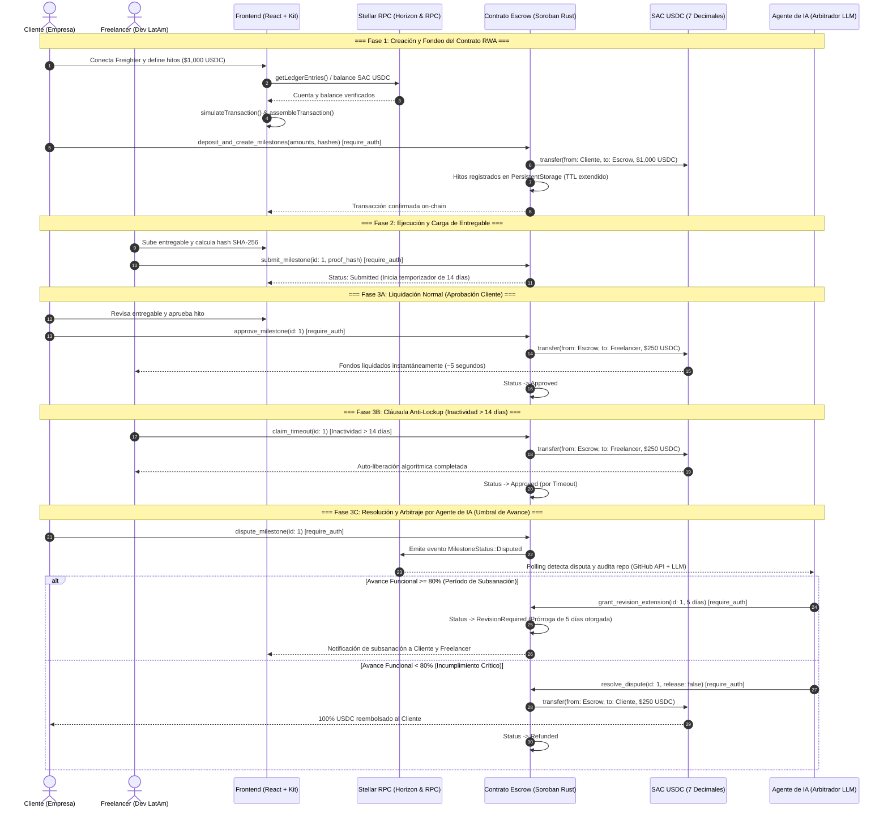
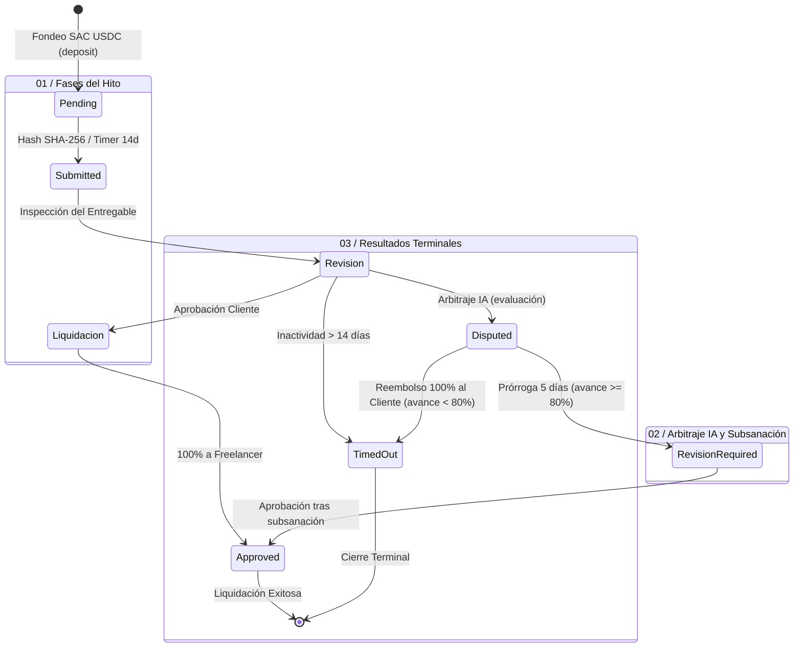

# AgreedPay: Especificación de Arquitectura de Software y Protocolo On-Chain
**Checkpoint Técnico Intermedio: Documento Maestro de Arquitectura**  
**Versión:** 1.1.0  
**Ecosistema:** Stellar Network & Soroban Smart Contracts (`#![no_std]`)  
**Activo de Custodia:** SAC USDC (Stellar Asset Contract - 7 Decimales)  
**Tesis:** Tokenización RWA (Real World Assets) de Contratos Comerciales de Servicios y Arbitraje de IA  

---

## 1. Visión General del Protocolo y Tesis RWA

### 1.1. Contexto de Negocio y Problemática en LatAm
El mercado de exportación de servicios profesionales y talento tecnológico desde América Latina hacia mercados globales enfrenta barreras operativas críticas:
* **Costos de Fricción Financiera:** Las transferencias interbancarias internacionales vía SWIFT imponen comisiones fijas y tipos de cambio desfavorables que consumen entre el 5% y el 10% del valor del contrato.
* **Tiempos de Liquidación Prolongados:** Demoras de 3 a 7 días hábiles para la compensación de fondos, agravadas por retenciones tributarias y trabas cambiarias locales.
* **Riesgo de Contraparte y Desconfianza:** Los proveedores de servicios desarrollan software sin garantías de pago inmutables, mientras que los contratantes dudan de desembolsar anticipos sin entregables auditables.

### 1.2. La Tesis RWA de AgreedPay
**AgreedPay** resuelve esta asimetría transformando los contratos comerciales de servicios de software (*Statements of Work* - SOW y *Service Level Agreements* - SLA) en **Activos del Mundo Real (RWA) Tokenizados** sobre la red Stellar.

A través de un contrato inteligente de custodia programable en Soroban:
1. El acuerdo contractual off-chain se vincula formalmente al ledger mediante el **hash criptográfico SHA-256** de sus especificaciones técnicas y criterios de aceptación.
2. Los fondos en USDC se bloquean de manera no custodial y segregada por cada hito (*milestone*) pactado.
3. La liquidación de cada hito se ejecuta de forma atómica, algorítmica y transparente al cumplirse las condiciones pactadas.

### 1.3. Custodia Financiera en SAC USDC (7 Decimales)
La custodia de fondos opera a través del **Stellar Asset Contract (SAC)** oficial para el token **USDC** emitido en Stellar.
* **Precisión y Unidades Mínimas:** En la red Stellar, USDC utiliza formalmente **7 posiciones decimales**. La unidad mínima contable en el ledger (stroop) se define como:
  $$\text{1 USDC} = 10{,}000{,}000\text{ stroops} = 10^7\text{ stroops}$$
* **Aritmética Entera:** Todas las operaciones de balance y montos se computan en enteros con signo de 128 bits (`i128`), erradicando pérdidas por redondeo y previniendo desbordamientos aritméticos.
* **Custodia Descentralizada:** El contrato `escrow_milestones.rs` retiene los tokens bajo su propia dirección de contrato (`Address`); ningún participante ni administrador tiene facultades para movilizar fondos fuera de las transiciones de estado explícitamente autorizadas.

### 1.4. Protocolo de Arbitraje y Resolución de Disputas Asistido por IA
A diferencia de los esquemas tradicionales que dependen de juzgados o comités humanos lentos y costosos, AgreedPay implementa un **mecanismo de arbitraje descentralizado mediante un agente de IA**:
* **Apertura de Disputa:** Si el cliente detecta discrepancias en el entregable, activa el estado `Disputed`.
* **Auditoría Técnica Objetiva:** El agente de arbitraje off-chain inspecciona el repositorio (vía GitHub API) y analiza los commits, pull requests, cobertura de pruebas y diffs contra los criterios de aceptación del SOW.
* **Regla de Corte Funcional del 80%:**
  * **Avance Funcional ≥ 80% (Período de Subsanación):** Se presume buena fe y progreso sustancial. El agente invoca `grant_revision_extension(milestone_id, 5_dias)` en el contrato. El hito pasa a `RevisionRequired`, otorgando al desarrollador una prórroga de **5 días calendario** para corregir observaciones técnicas sin penalización financiera.
  * **Avance Funcional < 80% (Incumplimiento Crítico):** Se determina incumplimiento grave del servicio. El agente invoca `resolve_dispute(milestone_id, release: false)`. El contrato reembolsa de forma inmediata e irrevocable el **100% de los fondos bloqueados** para ese hito a la cuenta del cliente contratante.

---

## 2. Topología del Sistema y Arquitectura por Capas

El sistema se estructura en **cinco capas desacopladas**, garantizando separación estricta entre la interacción del usuario, la infraestructura RPC, la lógica on-chain y el oráculo de auditoría externa.

### 2.1. Diagrama de Topología del Sistema (Mermaid)

```mermaid
flowchart LR
    %% CAPA 1: USUARIOS Y BILLETERAS
    subgraph L1 ["Capa de Usuarios & Billeteras"]
        direction TB
        ClientUser["Empresa Contratante<br/>(Freighter Wallet)"]
        FreelancerUser["Desarrollador LatAm<br/>(Freighter Wallet)"]
    end

    %% CAPA 2: APLICACIÓN FRONTEND
    subgraph L2 ["Capa de Aplicación Frontend"]
        direction TB
        ClientPanel["Panel del Cliente<br/>(Creación RWA & Fondeo)"]
        WalletKit["Stellar Wallets Kit<br/>(Gestión de Sesión Web3)"]
        FreelancerPanel["Panel Freelancer<br/>(Carga SHA-256 & Timeout)"]
    end

    %% CAPA 3: COMUNICACIÓN Y CONSENSO
    subgraph L3 ["Capa de Comunicación & Consenso"]
        direction TB
        StellarRPC["Stellar RPC / Horizon<br/>(Horizon & SAC Balance)"]
        SorobanRPC["Soroban RPC Node<br/>(simulate & assemble Tx)"]
    end

    %% CAPA 4: ON-CHAIN (SOROBAN RUNTIME)
    subgraph L4 ["Capa On-Chain (Soroban Runtime)"]
        direction TB
        SACUSDC["SAC USDC<br/>(Stellar Asset Contract 7 Decimales)"]
        EscrowContract["escrow_milestones.rs<br/>(Contrato Principal Soroban Rust)"]
    end

    %% CAPA 5: AUDITORÍA Y AGENTE DE IA
    subgraph L5 ["Capa de Auditoría y Agente de IA"]
        direction TB
        SupabaseDB[("SupabaseDB<br/>(Metadatos Off-Chain)")]
        AIAgent["Agente de IA<br/>(AI Dispute Resolver Arbitraje LLM)"]
        StellarExpert["StellarExpert<br/>(Trazabilidad Pública Tx)"]
    end

    %% CONEXIONES
    ClientUser -->|"Firma Freighter"| ClientPanel
    FreelancerUser -->|"Firma Freighter"| FreelancerPanel
    ClientPanel --> WalletKit
    FreelancerPanel --> WalletKit

    WalletKit -->|"getLedgerEntries"| StellarRPC
    WalletKit -->|"simulateTx / assembleTx"| SorobanRPC

    StellarRPC -.->|"Verifica balance"| SACUSDC
    SorobanRPC -->|"Invocación WASM"| EscrowContract

    EscrowContract <-->|"Transferencias atómicas"| SACUSDC

    SACUSDC -.->|"Eventos Off-Chain"| SupabaseDB
    EscrowContract -.->|"Trazabilidad Tx"| StellarExpert
    AIAgent -->|"resolve_dispute() firmado"| EscrowContract
    EscrowContract -.->|"MilestoneStatus::Disputed"| AIAgent
```

### 2.2. Responsabilidades por Capa

1. **Capa de Usuarios & Billeteras:** Autenticación no custodial mediante **Freighter Wallet** para la firma criptográfica segura de transacciones.
2. **Capa de Aplicación Frontend:** Interfaz en React / TypeScript con soporte de `@stellar/stellar-wallets-kit` para orquestar la conexión y los flujos diferenciados de cliente (fondeo) y freelancer (entregas y reclamos).
3. **Capa de Comunicación & Consenso:**
   - **Stellar RPC / Horizon:** Consultas de estado de cuenta y saldos SAC USDC vía `getLedgerEntries`.
   - **Soroban RPC Node:** Simulación transaccional (`simulateTransaction`) para determinar footprints de almacenamiento y empaquetado final (`assembleTransaction`).
4. **Capa On-Chain (Soroban Runtime):** Ejecución del contrato inteligente `escrow_milestones.rs` (`#![no_std]`) en WebAssembly y coordinación con el `SAC USDC` nativo.
5. **Capa de Auditoría y Agente de IA:**
   - **SupabaseDB:** Repositorio de metadatos off-chain pesados (especificaciones SOW, documentación, referencias Git).
   - **Agente de IA:** Servicio oráculo con clave autorizada (`arbiter`) para auditar código y dictaminar resoluciones técnicas.
   - **StellarExpert:** Registro público e indexación abierta de todas las transacciones del protocolo.

---

## 3. Ciclo de Vida del Hito y Protocolo de Interacción

### 3.1. Diagrama de Secuencia de Interacción (Mermaid)

### 3.2. Fases Operativas del Ciclo de Vida

* **Fase 1 (Creación y Fondeo):** El cliente define montos y hashes SHA-256 de los hitos. Se ejecuta `deposit_and_create_milestones`, transfiriendo el monto acumulado en SAC USDC al escrow y protegiendo los datos con extensión de TTL en `PersistentStorage`.
* **Fase 2 (Ejecución y Carga):** El freelancer carga el entregable, calcula su hash SHA-256 e invoca `submit_milestone`. Se fija el timestamp en el ledger y se inicia la ventana de inactividad de **14 días** (1,209,600 segundos).
* **Fase 3A (Liquidación Normal):** Al verificar conformidad, el cliente llama a `approve_milestone`. El contrato ejecuta el desembolso atómico inmediato del hito hacia el freelancer.
* **Fase 3B (Cláusula Anti-Lockup):** Si el cliente no interactúa dentro de los 14 días posteriores al envío, el freelancer invoca `claim_timeout`. El contrato verifica el tiempo transcurrido en el ledger y transfiere los fondos automáticamente, previniendo el secuestro de liquidez.
* **Fase 3C (Arbitraje por Agente de IA):** Ante disconformidad formal del cliente, se abre una disputa y el agente IA audita commits, diffs y pruebas:
  - *Avance ≥ 80%:* Otorga 5 días de prórroga mediante `grant_revision_extension` para subsanar observaciones.
  - *Avance < 80%:* Ejecuta `resolve_dispute(false)`, reintegrando el 100% del hito a la empresa contratante.

---

## 4. Máquina de Estados Finita del Hito

### 4.1. Diagrama de Estados (Mermaid)

### 4.2. Matriz Formal de Transiciones de Estado

| Estado Origen | Función Disparadora | Invocador Autorizado | Precondición (Guarda) | Estado Destino | Acción Financiera (SAC USDC) |
|---|---|---|---|---|---|
| `(None)` | `deposit_and_create_milestones` | Cliente | Saldo suficiente en cuenta cliente | `Pending` | Transferencia `Cliente -> Contrato` (Monto Total) |
| `Pending` | `submit_milestone` | Freelancer | Hito en turno; `proof_hash != 0` | `Submitted` | Ninguna. Se inicia temporizador de 14 días. |
| `Submitted` | `approve_milestone` | Cliente | Hito en estado `Submitted` | `Approved` | Transferencia `Contrato -> Freelancer` (Monto Hito) |
| `Submitted` | `claim_timeout` | Freelancer | `ledger_timestamp >= submitted_at + 14d` | `Approved` | Transferencia `Contrato -> Freelancer` (Monto Hito) |
| `Submitted` | `dispute_milestone` | Cliente | `ledger_timestamp < submitted_at + 14d` | `Disputed` | Ninguna. Se congelan los temporizadores. |
| `Disputed` | `grant_revision_extension` | Agente IA (Árbitro) | Score LLM ≥ 80% de avance | `RevisionRequired` | Ninguna. Extiende plazo por 5 días adicionales. |
| `RevisionRequired` | `submit_milestone` | Freelancer | `ledger_timestamp <= extension_deadline` | `Submitted` | Ninguna. Se reinicia ventana de revisión. |
| `Disputed` | `resolve_dispute(false)` | Agente IA (Árbitro) | Score LLM < 80% de avance | `Refunded` | Transferencia `Contrato -> Cliente` (100% Monto Hito) |
| `Disputed` | `resolve_dispute(true)` | Agente IA (Árbitro) | Subsanación verificada conforme | `Approved` | Transferencia `Contrato -> Freelancer` (Monto Hito) |

---

## 5. Especificación Técnica de Soroban Rust (`#![no_std]`)

### 5.1. Modelo de Dominio On-Chain
El contrato inteligente `escrow_milestones.rs` opera en un entorno WebAssembly estricto sin biblioteca estándar (`#![no_std]`), segregando el almacenamiento entre configuración de instancia y persistencia de hitos:

| Estructura / Tipo | Tipo de Almacenamiento | Campos Clave | Propósito Arquitectónico |
|---|---|---|---|
| `ContractConfig` | `InstanceStorage` | `client`, `freelancer`, `arbiter`, `token`, `milestone_count` | Parámetros singleton inmutables y direcciones con roles de acceso. |
| `Milestone` | `PersistentStorage` | `id`, `amount`, `proof_hash`, `submitted_at`, `extension_deadline`, `status` | Entidad granular de cada hito; renueva su TTL en cada interacción. |
| `MilestoneStatus` | Enum On-Chain | `Pending`, `Submitted`, `Disputed`, `RevisionRequired`, `Approved`, `Refunded` | Control determinista de la máquina de estados. |
| `DataKey` | Enum de Acceso | `Config`, `Milestone(u32)` | Espacio de claves tipado para lectura y escritura segura en el ledger. |

### 5.2. Matriz de Interfaces del Smart Contract

| Interfaz Pública | Roles con `require_auth` | Parámetros Principales | Efecto de Estado y Financiero |
|---|---|---|---|
| `deposit_and_create_milestones` | `client` | `client`, `freelancer`, `arbiter`, `token`, `milestones_data` | Inicializa configuración, transfiere total en SAC USDC al escrow y persiste hitos en `Pending`. |
| `submit_milestone` | `freelancer` | `milestone_id`, `proof_hash` | Registra hash SHA-256, fija timestamp en ledger e inicia temporizador de 14 días (`Submitted`). |
| `approve_milestone` | `client` | `milestone_id` | Cambia estado a `Approved` y transfiere atómicamente el monto del hito al freelancer. |
| `claim_timeout` | `freelancer` | `milestone_id` | Valida expiración de 14 días sin respuesta del cliente y auto-libera fondos al freelancer. |
| `grant_revision_extension` | `arbiter` (Agente IA) | `milestone_id`, `extension_seconds` | Concede prórroga de 5 días para subsanar observaciones técnicas (`RevisionRequired`). |
| `resolve_dispute` | `arbiter` (Agente IA) | `milestone_id`, `release_to_freelancer` | Si es favorable: liquida a freelancer. Si es desfavorable (< 80%): reembolsa 100% al cliente. |

### 5.3. Tópicos de Eventos Publicados
El contrato emite eventos indexables mediante `env.events().publish(...)` para sincronización con la capa off-chain:
* `(symbol_short!("created"), client, total_amount)`: Notifica el fondeo exitoso del contrato.
* `(symbol_short!("submitted"), milestone_id, proof_hash)`: Notifica entrega técnica de entregable.
* `(symbol_short!("approved"), milestone_id, amount)`: Notifica liquidación ordinaria o por timeout.
* `(symbol_short!("disputed"), milestone_id)`: Dispara la intervención inmediata del oráculo de arbitraje IA.
* `(symbol_short!("extended"), milestone_id, extension_deadline)`: Notifica prórroga concedida.
* `(symbol_short!("resolved"), milestone_id, release_to_freelancer)`: Notifica la resolución definitiva de disputa.

---

## 6. Arquitectura Off-Chain, Integración RPC y Base de Datos (Supabase)

### 6.1. Diccionario de Entidades Off-Chain (Supabase / PostgreSQL)

Para evitar sobrecostos de almacenamiento on-chain, los datos pesados y documentales se gestionan en Supabase con políticas de acceso a nivel de fila (RLS):

| Entidad (Tabla) | Atributos Principales | Relaciones y Llaves | Propósito en el Sistema |
|---|---|---|---|
| `contracts` | `id`, `stellar_contract_id`, `client_address`, `freelancer_address`, `arbiter_address`, `token_address`, `total_amount_usdc`, `sow_document_url`, `sow_hash` | PK: `id` UK: `stellar_contract_id` | Registro maestro del contrato RWA, vinculando el ID de Soroban con el hash SHA-256 del SOW legal. |
| `milestones` | `id`, `contract_id`, `milestone_index`, `title`, `description`, `amount_usdc`, `proof_hash`, `github_repo_url`, `github_pr_url`, `status`, `submitted_at`, `timeout_deadline`, `extension_deadline` | PK: `id` FK: `contract_id -> contracts(id)` UK: `(contract_id, milestone_index)` | Metadatos funcionales de cada hito, enlaces de inspección a GitHub y seguimiento temporal. |
| `disputes` | `id`, `milestone_id`, `initiated_by`, `client_reason`, `ai_functional_score`, `ai_evaluation_report`, `decision`, `resolved_at`, `transaction_hash` | PK: `id` FK: `milestone_id -> milestones(id)` | Registro de auditoría técnica con veredicto, puntaje del modelo LLM y hash de resolución on-chain. |

* **Modelo de Seguridad RLS:** Políticas restrictivas de escritura basadas en firmas y lectura pública de registros para auditoría abierta de contratos e hitos.
* **Estrategia de Indexación:** Índices B-Tree optimizados en `stellar_contract_id`, `client_address`, `freelancer_address` y `status` para búsquedas en tiempo real.

### 6.2. Orquestación del Agente de Arbitraje IA
1. **Monitor RPC:** Daemon en Node.js/TypeScript suscrito a eventos de Soroban RPC (`getEvents`) filtrando el tópico `disputed`.
2. **Pipeline de Análisis:** Al capturar una disputa, clona el repositorio de GitHub y procesa los diffs de código y tests frente a las especificaciones del SOW mediante un LLM especializado en auditoría de software con temperatura 0.0.
3. **Cálculo de Métrica:** Genera una evaluación cuantitativa del porcentaje de completitud técnica (0% a 100%).
4. **Firma y Despacho:** 
   - Si $\text{Score} \ge 80\%$: Firma y transmite `grant_revision_extension`.
   - Si $\text{Score} < 80\%$: Firma y transmite `resolve_dispute(release: false)`.

---

## 7. Modelo de Seguridad, Resiliencia y Checklist Pre-Deploy

### 7.1. Matriz de Vectores de Ataque y Mitigaciones

| Vector de Ataque Potencial | Nivel de Riesgo | Mecanismo de Mitigación en AgreedPay |
|---|---|---|
| **Reentrancy Attack** | Alto | Implementación estricta del patrón **Checks-Effects-Interactions (CEI)**. Se actualizan los estados internos antes de invocar las transferencias en el cliente SAC. |
| **Impersonación / Acceso No Autorizado** | Crítico | Verificación criptográfica con `address.require_auth()` en todas las funciones sensibles. |
| **State Expiration (Archivado TTL)** | Medio | Renovación obligatoria de Time-To-Live (`extend_ttl`) en cada transacción sobre `PersistentStorage`. |
| **Pérdida de Precisión Aritmética** | Alto | Manejo absoluto de montos en enteros `i128` con escala fija de 7 decimales ($10^7$). Sin tipos de coma flotante. |
| **Abandono o Desidia de Contraparte** | Medio | Cláusula algorítmica `claim_timeout` que previene el secuestro de fondos más allá de 14 días. |
| **Falla o Compromiso del Oráculo IA** | Alto | Clave privada del árbitro resguardada en KMS con rotación de credenciales y límite de actuación circunscrito a disputas abiertas. |

### 7.2. Checklist Técnico Pre-Deploy

- [ ] **Configuración Toolchain:** Rust `stable` con target `wasm32-unknown-unknown` y Stellar CLI instalado.
- [ ] **Compilación `#![no_std]`:** `cargo check --target wasm32-unknown-unknown` sin dependencias `std`.
- [ ] **Suite de Pruebas Unitarias:** Cobertura de fondeo, aprobación ordinaria, auto-liberación por timeout y bifurcación de arbitraje (≥ 80% prórroga vs. < 80% reembolso).
- [ ] **Optimización WASM:** Generación de binario optimizado con `stellar contract optimize`.
- [ ] **Despliegue e Indexación:** Publicación de bytecode en Stellar Testnet, enlace con SAC USDC de prueba y verificación pública en StellarExpert.
